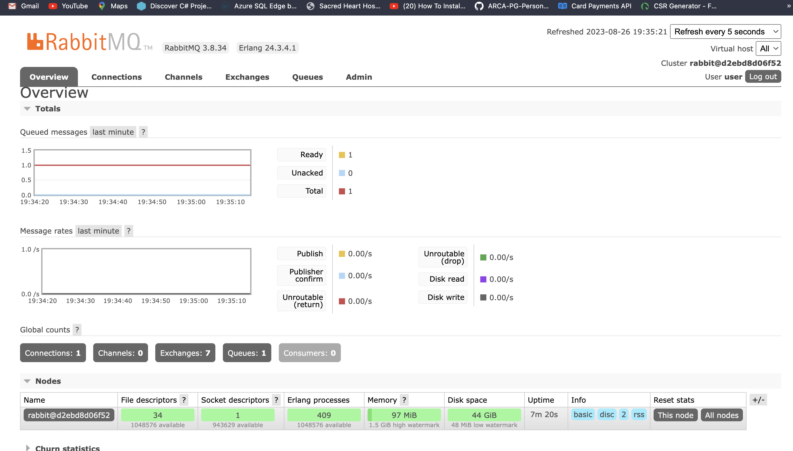

##### Create a new folder called MQ

##### add a new solution
- dotnet new sln --name FormulaAirline
The template "Solution File" was created successfully.

###### add a new project API -> Producer
- dotnet new webapi -n "FormulaAirline.API"
The template "ASP.NET Core Web API" was created successfully.

##### Add the Web API proj to the solution
- dotnet sln FormulaAirline.sln add FormulaAirline.API/FormulaAirline.API.csproj


##### Create the  console app -> Consumer
- dotnet new console -n "FormulaAirline.TicketProcessing"

##### Add the console app to the solution
- dotnet sln FormulaAirline.sln add FormulaAirline.TicketProcessing/FormulaAirline.TicketProcessing.csproj


##### install rabbitmq
- cd FormulaAirline.API
- dotnet add package RabbitMQ.Client


---

##### install ef and sqlserver
dotnet add package Microsoft.EntityFrameworkCore.SqlServer
dotnet add package Microsoft.EntityFrameworkCore.Design
dotnet add package Microsoft.EntityFrameworkCore.Tools


###### Create a docker-compose.yml file in the root of the solution
```yml
version: '3.8'
services:
  rabbitmq:
    container_name: "rabbitmq"
    image: rabbitmq:3.8-management-alpine
    environment:
      - RABBITMQ_DEFAULT_USER=user
      - RABBITMQ_DEFAULT_PASS=mypass
    ports:
    # Rabbit mq instance
      - '5672:5672'
    # web interface
      - '15672:15672'
```


Run the docker-compose file
- docker-compose up -d

#### check the rabbitmq management portal
- http://localhost:15672/


Enter the username and password from the docker-compose file


##### to test the api
- cd FormulaAirline.API
- dotnet run

If you send the request to the api, you will see the message in the rabbitmq management portal



---

##### Consumer
- cd FormulaAirline.TicketProcessing
- dotnet add package RabbitMQ.Client


